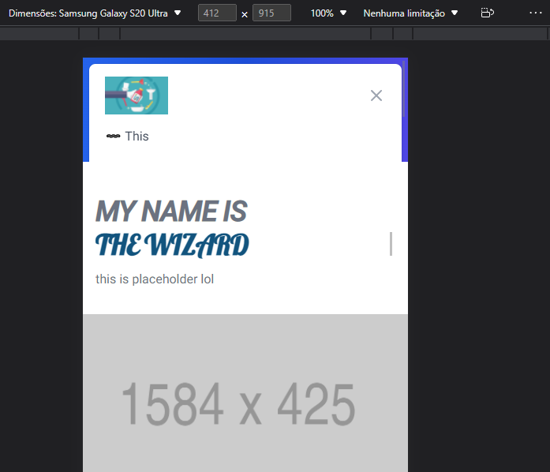
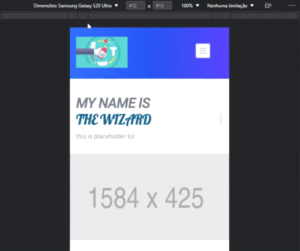

# (MOBILE) The navbar component doesnt change size to adapt the popover

When the button to open the popover.panel is clicked it doesnt expand the original height of the section to acomoddate the panel, It just makes it scrollable.

